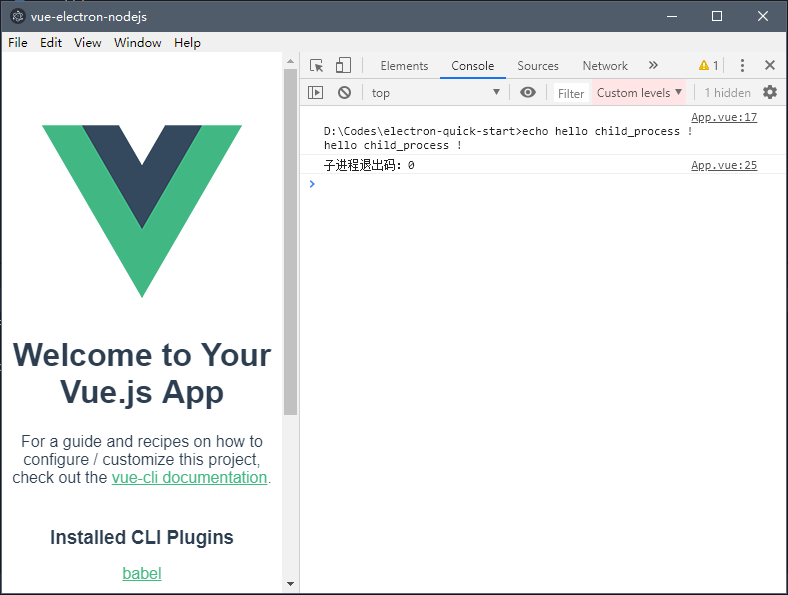

# Vue + Electron 混合开发并使用 Node.js 遇到的一个坑

## 场景

曾经做过这么一个奇葩需求:  
使用 `Vue` + `Electron` 混合开发并使用 `Node.js` 子进程(`child_process`)调用 `.NET Core` 程序的一个项目. 于是乎就遇到了如下的坑记录于此.

## Node.js 报错

如果你使用 `Vue` + `Electron` 混合开发并且需要使用 `Node.js` (如: `http` `child_process`), 你很大概率会遇到类似如下的错误:

::: danger
Uncaught TypeError: http.createServer is not a function  
OR  
Uncaught TypeError: spawn is not a function
:::

很明显, 这是因为 **直接把 `Node` 程序在浏览器运行** 而报的错; 或许你没有这么做, 但是 `Vue` 帮你这么做了, 确切的说是 `Webpack` 帮你这么做了.

### 测试环境

> Vue CLI = 3.7.0  
> Electron = 5.0.0  
> Node = 10.15.3  

默认情况下`Vue CLI` 输出的资源本身就是供浏览器直接运行的, 所以才会出现这种情况. 

### 解决问题 

既然知道了原因是由于 `Vue CLI` 使用了 `Webpack` 打包出来了仅供浏览器运行的资源, 那么我们如何让 `Webpack` 打包出供 `Node` 服务器运行的资源呢?  
很简单, 在基于 Vue CLI 3.0+ 的版本上, 在你的 Vue 项目根目录的 `vue.config.js` (没有 `vue.config.js` 的自行创建)里面添加如下高亮代码: 

#### vue.config.js
``` js{3,4,5}
module.exports = {
    publicPath: './',
    configureWebpack: {
        target: 'node-webkit'
    }
};
```

## 测试结果

### Vue CLI 直接运行

现在我直接在 Vue 运行调试发现还是报错, 这次的报错如下:

::: danger
Uncaught ReferenceError: require is not defined
:::

这次我管都不管它, 任由他报错, 因为经过上面对 `Webpack` 的配置后, 我们得到的资源已经不适合浏览器直接运行了, 所以 `Vue CLI` 直接调试肯定是有问题的.

### 通过 Electron 运行

`Electron` 本身就允许使用 `Node`（作为后端）的, 所以我们用它来运行试试.



::: tip
成功了🎉🎉🎉
:::

现在可以愉快的使用 `Vue` + `Electron` 混合开发并使用 `Node.js` 了😀.

